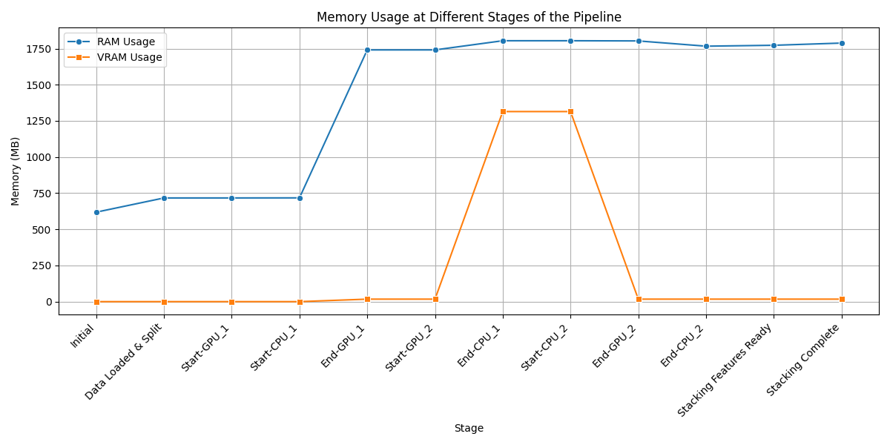
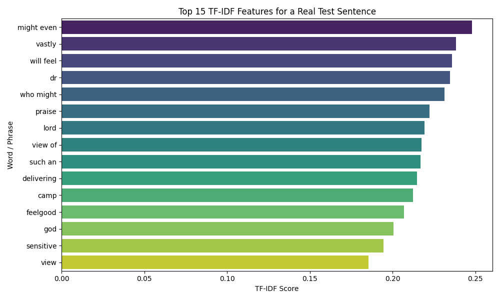
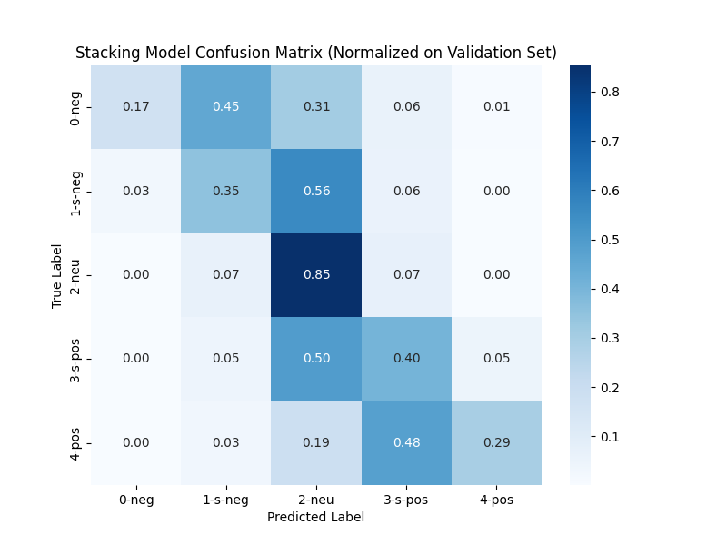
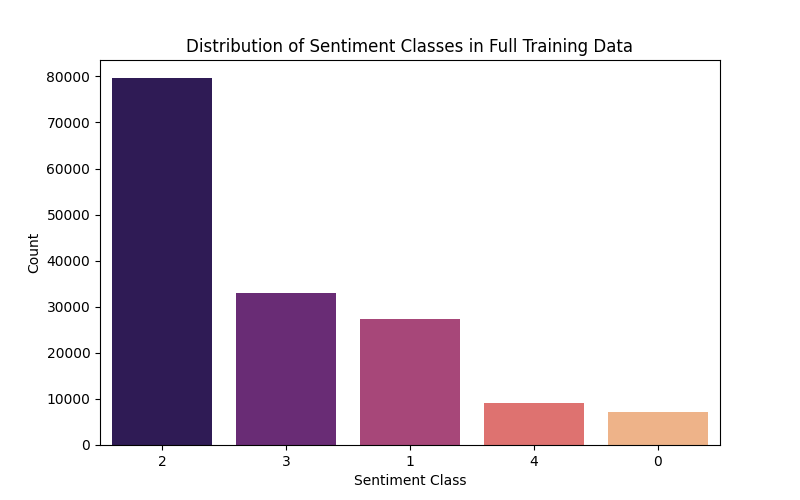
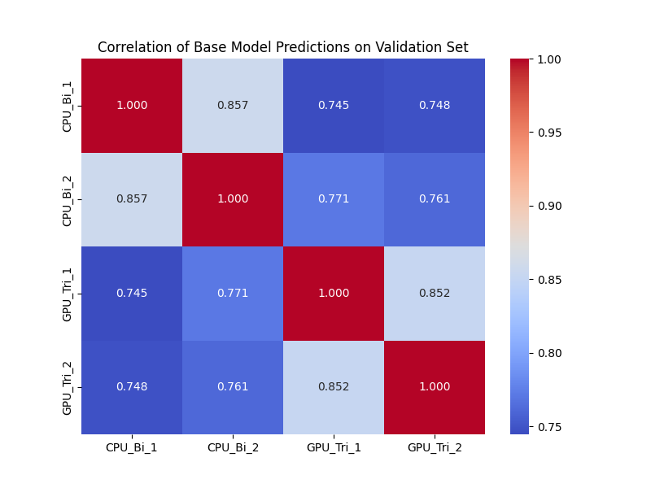

# UCAS-2025-fall-machine-learning-course-assignment
This is a part of a course assignment UCAS 2025 fall machine learning.

## Background[^1]
Based on various phrases extracted from movie reviews (these phrases come from real movie reviews on the Rotten Tomatoes website), predict a sentiment label for each phrase using a 5-level scale:

- **negative** (negative / very negative)
- **somewhat negative** (somewhat negative)
- **neutral** (neutral)
- **somewhat positive** (somewhat positive)
- **positive** (positive / very positive)

Find detailed question description, including data format description, through this [Kaggle link](https://www.kaggle.com/competitions/sentiment-analysis-on-movie-reviews, "sentiment analysis on movie reviews").
## Method
We have 3 models for this task, each based on **BoW** (Bag-of-Words), **SVM** (Support Vector Mechine) and Transformer respectively. This repo implements the model based on **BoW** and offers some figures that comes from training and evaluating process.

Because the basic **BoW** (Bag-of-Words) method is too simple and has many limitations, we adopted an improved approach proposed in a paper published in 2023[^2].

Briefly, in this article the author used BoW and MLP for classification:
- **Text Representation**: TF-IDF vectors using the top 30,000 unigrams, L2-normalized.
- **Classifier**: Multilayer Perceptron (MLP) with the following architecture:
  - Input: 30,000-dimensional TF-IDF vector
  - Hidden Layer 1: 500 units, ReLU activation
  - Hidden Layer 2: 500 units, ReLU activation
  - Output: Softmax (single-label) or Sigmoid (multi-label)
- **Regularization**: Dropout and early stopping
- **Loss**: Cross-entropy (single-label) or Binary cross-entropy (multi-label)

This simple yet wide MLP on TF-IDF consistently outperforms many complex graph-based models.
In our implementation, we added a smaller hidden layer after the existing layers, with half units of them to improve the model's nonlinear ability.
## Dataset and Data Processing
### Dataset Description
The dataset consists of tab-separated files(.tsv format) derived from the Rotten Tomatoes movie reviews. Sentences are parsed into multiple phrases using the Stanford parser, with the original train/test split preserved (though sentences are shuffled). Duplicate phrases (e.g., common short words) appear only once.

- **train.tsv**: Contains PhraseId, SentenceId, Phrase, and Sentiment label.
- **test.tsv**: Contains PhraseId, SentenceId, and Phrase (no labels; to be predicted).

**Sentiment Labels**:
- 0 — negative
- 1 — somewhat negative
- 2 — neutral
- 3 — somewhat positive
- 4 — positive
### Data Processing
Since we chose to use BoW as the base method, the data processing process is quite simple:

- clean dataset: Retain letters, numbers, and basic punctuation; remove excess whitespace. Do not remove the words "not", "very", or "but".
- Split the validation set using **group-based cross-validation**
  - Use the `SentenceId` column from `train.tsv` as the **group ID**.
  - Reason: In `train.tsv`, different phrases extracted from the same sentence are treated as separate samples. To avoid data leakage, all phrases from the same sentence must stay entirely within either the training set or the validation set.
- **TF-IDF Vectorization (BoW)**: 
  - Incorporates bigrams to capture semantic reversals (e.g., "not good").
  - Vocabulary limited to the top 30,000 most frequent terms.
```python
def load_and_process_data():
    # read tsv files and do cleaning 
    train_df = pd.read_csv('train.tsv', sep='\t')
    test_df = pd.read_csv('test.tsv', sep='\t')

    train_df['Phrase'] = train_df['Phrase'].fillna("")
    test_df['Phrase'] = test_df['Phrase'].fillna("")

    train_df['clean_text'] = train_df['Phrase'].apply(clean_text)
    test_df['clean_text'] = test_df['Phrase'].apply(clean_text)

    # Split dataset
    splitter = GroupShuffleSplit(n_splits=1, test_size=0.1, random_state=42)
    train_idx, val_idx = next(splitter.split(train_df, groups=train_df['SentenceId']))

    train_subset = train_df.iloc[train_idx].reset_index(drop=True)
    val_subset = train_df.iloc[val_idx].reset_index(drop=True)

    # TF-IDF vectorize (BoW)
    vectorizer = TfidfVectorizer(
        max_features=CONFIG['max_features'],
        ngram_range=CONFIG['ngram_range'],
        min_df=3,
        stop_words=None
    )

    # transform texts to matrix
    X_train = vectorizer.fit_transform(train_subset['clean_text'])
    X_val = vectorizer.transform(val_subset['clean_text'])
    X_test = vectorizer.transform(test_df['clean_text'])
    
    def to_tensor(sparse_matrix):
        return torch.FloatTensor(sparse_matrix.toarray())
    # to pytorch dataset
    train_dataset = RTDataset(to_tensor(X_train), train_subset['Sentiment'].values)
    val_dataset = RTDataset(to_tensor(X_val), val_subset['Sentiment'].values)
    test_tensor = to_tensor(X_test)

    return train_dataset, val_dataset, test_tensor, test_df['PhraseId']
``` 

## Models
We trained and evaluated 3 model versions:

1. **Baseline**: Single model trained on CPU.
2. **Bagging Ensemble**: Integration of 2 CPU-trained models and 2 GPU-trained models using **bagging**.
3. **Stacking Ensemble**: Integration of 2 CPU-trained models and 2 GPU-trained models using **stacking**.
### Baseline
The TF-IDF vector is defined in previous sections. The WideMLP class is defined as follows.
```python
class WideMLP(nn.Module):
    def __init__(self, input_dim, hidden_dim, num_classes):
        super(WideMLP, self).__init__()

        # 结构: Input -> 2*(Linear -> BatchNorm -> ReLU -> Dropout) -> Linear -> Output
        self.layers = nn.Sequential(
            nn.Linear(input_dim, hidden_dim),
            nn.BatchNorm1d(hidden_dim),
            nn.ReLU(),
            nn.Dropout(CONFIG['dropout']),
            nn.Linear(hidden_dim, hidden_dim // 2),  # 额外加一层以增强非线性能力
            nn.BatchNorm1d(hidden_dim // 2),
            nn.ReLU(),
            nn.Dropout(CONFIG['dropout']),
            nn.Linear(hidden_dim // 2, num_classes)
        )

    def forward(self, x):
        return self.layers(x)
```

### Bagging
We trained 2 models on CPU and 2 models on GPU, then we used soft voting for bagging, which gained 0.004 more point.
```python
# single model generates probilities
all_probs = []
  with torch.no_grad():
      for batch_X, _ in test_loader:
          batch_X = batch_X.to(config['device'])
          outputs = model(batch_X)
          probs = torch.softmax(outputs, dim=1).cpu().numpy()
          all_probs.append(probs)
  ...
ensemble_probs = []

for cfg in configs:
    if cfg['device'].type == 'cuda' and not torch.cuda.is_available():
        cfg['device'] = torch.device('cpu')

    probs = train_single_model(cfg, train_df, val_df, test_df, cfg['name'])
    ensemble_probs.append(probs)
# Soft Voting
avg_probs = np.mean(ensemble_probs, axis=0)
final_predictions = np.argmax(avg_probs, axis=1)
```

### Stacking
After training 4 models, we used stacking to improve. We used logistic regression as meta model. This model gained 0.0003 more point than bagging model.
``` python
val_meta_features = []
test_meta_features = []

for name, v_prob, t_prob in results:
    print(f"    集成: {name}")
    val_meta_features.append(v_prob)
    test_meta_features.append(t_prob)
# stack
X_meta_train = np.hstack(val_meta_features)
X_meta_test = np.hstack(test_meta_features)

# Meta-Learner
meta_model = LogisticRegression(C=1.0, max_iter=1000, solver='lbfgs')
meta_model.fit(X_meta_train, y_val)

final_predictions = meta_model.predict(X_meta_test)
```

## Results
### Results on Kaggle


### Some Features
#### Memory Usage



#### Top 15 TF-IDF Features For a Test Case
(The title of the picture is wrong, it does not come from a "Sentence" rather it comes from a whole test. **Please pay attention** if you need to use this picture.)

As we can see from the picture, many of the top 15 phrases barely have things to do with sentiment. Most of them just play a supportive role, but they consume a large amount of memory and also possibly affect the model's judgment negatively.

#### Model Bias Analysis
The following picture shows the confusion matrix of the stacking model. 


The model exhibits a conservative bias, showing a strong tendency to predict **neutral**.

- **somewhat negative (s-neg)**:  
  The primary error is predicting neutral, with the proportion predicted as neutral **higher** than the proportion correctly predicted as s-neg.

- **somewhat positive (s-pos)**:  
  The primary error is predicting neutral, with the proportion predicted as neutral **higher** than the proportion correctly predicted as s-pos.

- **negative (neg)**:  
  The primary error is predicting somewhat negative (s-neg), followed by neutral, with the proportion predicted as neutral **higher** than the proportion correctly predicted as neg.

- **positive (pos)**:  
  The primary error is predicting somewhat positive (s-pos), followed by neutral, with the proportion predicted as neutral **higher** than the proportion correctly predicted as pos.

This might be creditted to the distribution of the data set(see in the following picture): most of labels are neutral.



Overall, the model tends to avoid extreme sentiment labels (neg and pos), preferring neutral or milder labels, resulting in insufficient discrimination in fine-grained sentiment classification.
#### Correlation in Stacking


#### Potential Improvement
~~写ppt的同学想想吧~~
## References
[^1]: Will Cukierski. (2014). *Sentiment Analysis on Movie Reviews*. Kaggle. Available at: https://www.kaggle.com/competitions/sentiment-analysis-on-movie-reviews
[^2]: Galke, L. (2023). *Are We Really Making Much Progress? Bag-of-Words vs. Sequence vs. Graph vs. Hierarchy for Single-label and Multi-label Text Classification*. https://api.semanticscholar.org/CorpusID:268090830
